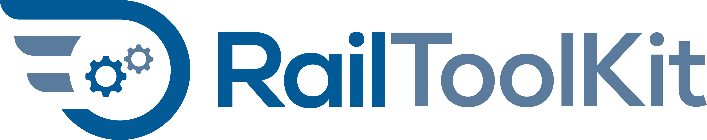

# 

**Open tools for railway research — built by the community, for the community.**

RailToolKit is an open-source ecosystem of Julia packages for railway engineering and research. We bring together researchers, engineers, and developers who believe that the tools powering railway science should be transparent, reproducible, and freely available to everyone.

Whether you study train dynamics, design timetables, model infrastructure, or teach railway engineering — you are welcome here. Use our tools, report bugs, share ideas, or contribute code. Every perspective makes the project stronger.

- **GitHub:** [github.com/railtoolkit](https://github.com/railtoolkit)
- **Website:** [railtoolkit.org](https://railtoolkit.org)
- **Mastodon:** [@railtoolkit@fosstodon.org](https://fosstodon.org/@railtoolkit)

---

## Why We Exist

Railway research depends on computation — running time calculations, timetable optimization, capacity analysis — yet the tools behind that computation are largely hidden. Across academia and industry, critical work relies on:

- **Proprietary software** with opaque algorithms and hidden assumptions
- **Excel spreadsheets** passed between colleagues, with formulas buried in cells
- **One-off scripts** that work once but cannot be adapted or verified
- **Siloed knowledge** where methods disappear when experts move on

Research findings cannot be independently verified. Methodologies cannot be compared across studies. New researchers reinvent the wheel instead of building on what came before.

We started RailToolKit because we think railway science deserves the same open foundations that other disciplines take for granted — the way astronomy has AstroPy, bioinformatics has BioConductor, and climate science has shared models. Railway engineering should be no different.

---

## Our Approach

RailToolKit is built on three principles that guide every design decision and contribution:

### 1. **Literate Programming**
Code and documentation live together. Every calculation is explained, every assumption is visible, and every result can be traced to its origin. Using Jupyter notebooks and Julia's documentation capabilities, we make the "why" as clear as the "what."

### 2. **Open Data Standards**
Common YAML and JSON schemas let tools exchange data seamlessly. A train defined once can be used across simulation, optimization, and analysis. Infrastructure models stay consistent from planning through operation.

### 3. **Modular Architecture**
Each package solves one problem well and connects cleanly to others. Combine tools like building blocks to create the workflow you need — without fighting monolithic software.

**Our goal:** Write your analysis once, document it clearly, and let others build on it for decades to come.

---

## TrainRuns.jl: The Foundation in Action

Our showcase package, TrainRuns.jl, demonstrates these principles in practice. It performs physics-based train running time calculations with full transparency.

### A Minimal Example

```julia
using TrainRuns

# Load train and path from YAML files with documented parameters
train = Train("train.yaml")
path = Path("path.yaml")

# Calculate the train run
result = trainrun(train, path)

# Extract total running time
runtime = result[end, :t]
println("Running time: $runtime seconds")
```

### What Makes This Different?

**Transparency:** Every resistance force, every energy calculation, every optimization step is documented and accessible. Researchers can examine why a simulation produces specific results.

**Reproducibility:** The same input files produce identical results on any system. Published studies can be verified by running the exact code and data.

**Extensibility:** The calculation engine is modular. Researchers can modify traction models, add new resistance formulas, or experiment with optimization strategies without rewriting core functionality.

**Real Impact:** TrainRuns.jl is already being used in master's theses and research projects, demonstrating that open tools can meet rigorous academic standards.

---

## The Ecosystem Vision: Beyond One Package

TrainRuns.jl is the first component. The RailToolKit ecosystem is designed to encompass the full spectrum of railway analysis:

### Planned Components

- **TrainRuns.jl** ✓ Running time calculations (v1.0.4, stable)
- **RailCore.jl** → Shared type definitions and interfaces
- **TimetableOpt.jl** → Timetable construction and optimization
- **InfraModel.jl** → Railway infrastructure modeling
- **CapacityAnalysis.jl** → Network capacity calculations
- **EnergyOpt.jl** → Energy-efficient operation strategies

### The Interface Challenge

The critical work happening now is **interface design**. We are defining abstract types and data exchange protocols that enable these packages to work together seamlessly:

```julia
# Example: Shared abstract types in RailCore.jl
abstract type RailVehicle end
abstract type RailPath end
abstract type SimulationResult end

# Different packages implement these interfaces
struct ElectricTrain <: RailVehicle
    # TrainRuns.jl implementation
end

struct TimetableSlot <: RailPath
    # TimetableOpt.jl implementation
end
```

This foundation enables a future where researchers can:
- Simulate a train run with TrainRuns.jl
- Feed results into TimetableOpt.jl for schedule optimization
- Analyze infrastructure bottlenecks with CapacityAnalysis.jl
- All with consistent data formats and no manual conversion

---

## Why This Matters

### For Academic Research

**Reproducibility Crisis Solved:** Publications include executable code and data. Peer review can verify computational claims. Future researchers build on solid foundations rather than reimplementing from scratch.

**Collaboration Enabled:** Researchers across institutions share tools and methods. A train model developed in Germany can be used in a Japanese study without translation.

**Education Improved:** Students learn from transparent, well-documented implementations. The gap between textbook theory and practical application narrows.

### For Industry Practice

**Reduced Development Costs:** Rather than building proprietary tools from scratch, practitioners can adapt open components to their needs.

**Vendor Independence:** Analysis tools remain accessible even when commercial software licenses expire or vendors discontinue products.

**Standards Emergence:** Common data formats and calculation methods enable better collaboration between operators, consultants, and manufacturers.

### For Open Science

**Knowledge Preservation:** Methods don't disappear when researchers retire. Code repositories preserve institutional knowledge.

**Faster Innovation:** Building on proven open tools accelerates research cycles. Less time reinventing, more time discovering.

**Global Access:** Researchers in institutions without large software budgets can access state-of-the-art tools.

### Measurable Impact

- **Current:** TrainRuns.jl v1.0.4 stable, 9 stars, active development
- **Target:** 5+ interconnected packages
- **Long-term:** RailToolKit as the standard open ecosystem for railway research

---

## Get Involved

RailToolKit grows through its contributors. There is no single "owner" — the project belongs to everyone who participates. Here is how you can help:

### Write Code

- Design interfaces for RailCore.jl abstract types
- Implement packages for specific railway domains
- Improve documentation and tutorials
- Write tests to ensure reliability

Browse [open issues on GitHub](https://github.com/railtoolkit), pick something that interests you, and open a pull request.

### Share Domain Knowledge

- Describe use cases from your research or practice
- Validate models against real-world data
- Help define data format standards and calculation methods
- Give feedback on interface design

Open an issue, share example data, or join a design discussion — your expertise matters even if you never write a line of code.

### Support the Project

RailToolKit needs sustained support to reach its full potential:

- **Development resources:** Funding for dedicated developer time to build core infrastructure
- **Research integration:** Adoption in academic programs and industry projects validates and improves tools
- **Infrastructure:** Hosting for documentation, continuous integration, and data repositories

---

## Let's Build This Together

Every contribution — code, feedback, a use case, or funding — moves railway research toward a more open, reproducible future.

**Find us on [GitHub](https://github.com/railtoolkit), [railtoolkit.org](https://railtoolkit.org), or [Mastodon](https://fosstodon.org/@railtoolkit).**

---

*RailToolKit — open infrastructure for open science*